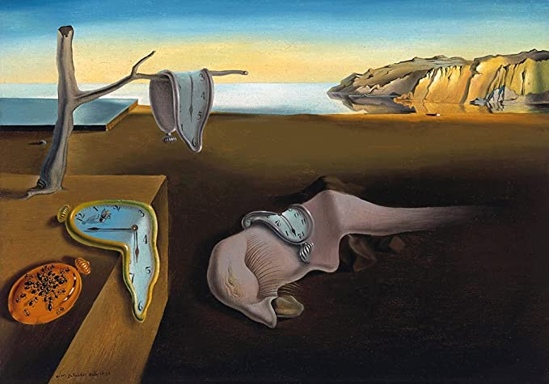
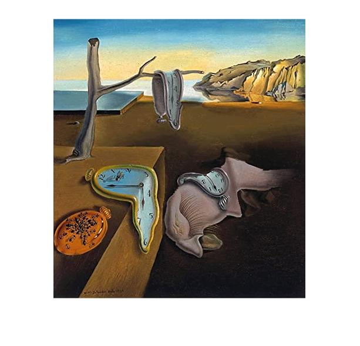

# seamCarving
Implementation of the "Seam Carving" [paper](http://citeseerx.ist.psu.edu/viewdoc/download?doi=10.1.1.570.6321&rep=rep1&type=pdf) in MATLAB. We use a dynamic programming algorithm to perform context aware image resizing (i.e, remove as little information as possible from the image) by minimising an 'energy funciton'.

## Before Seam Carving

## After Seam Carving

We observe that the main artifacts are not geometrically altered in the resized image. This is done by identifying the edges present in the query image using a blurring kernel and operating on this edge-space to find a path from the top to the bottom of the image that intersects with the least number of detected edges.
